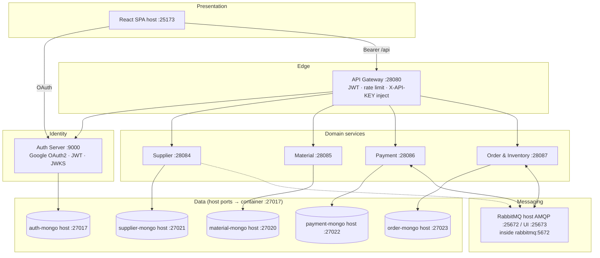
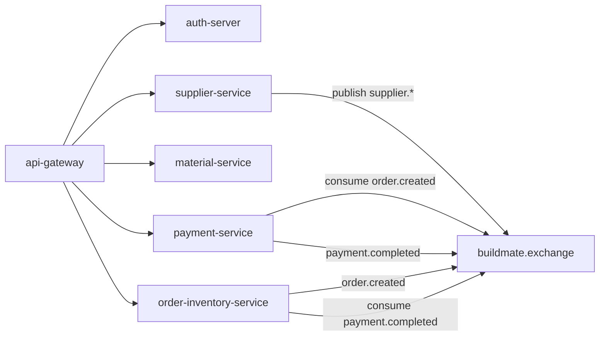
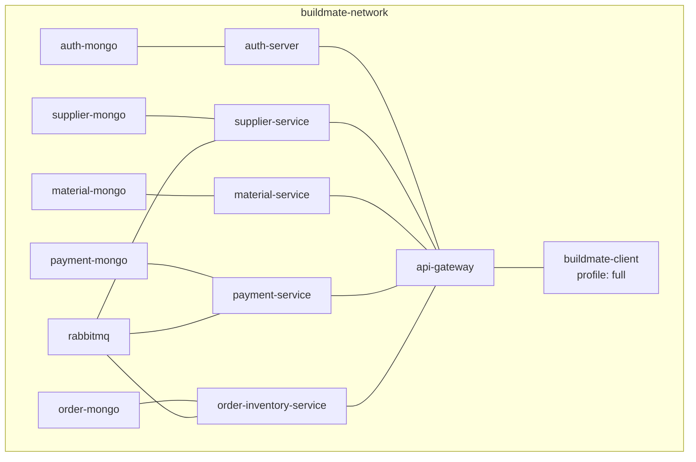
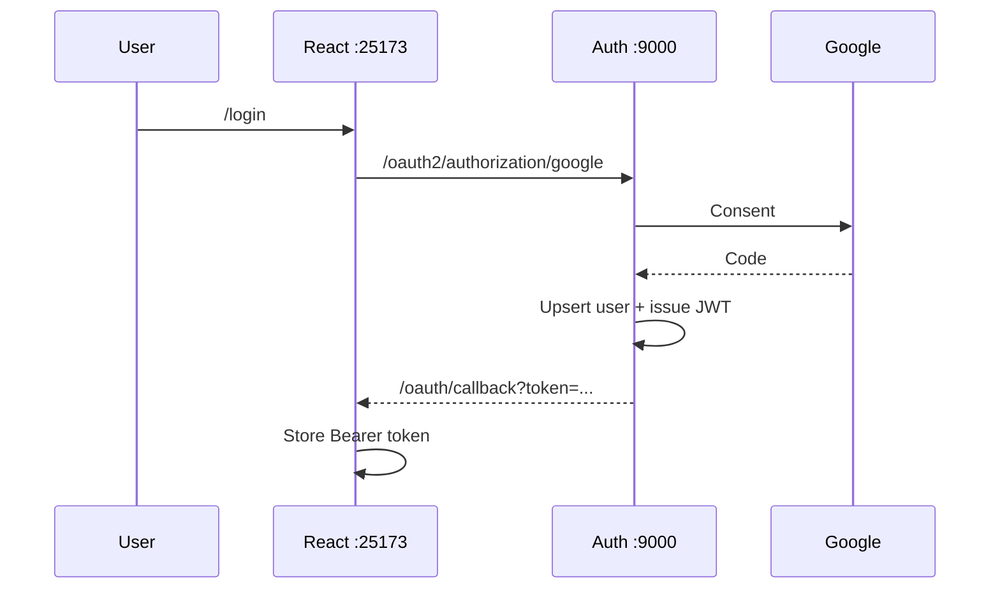
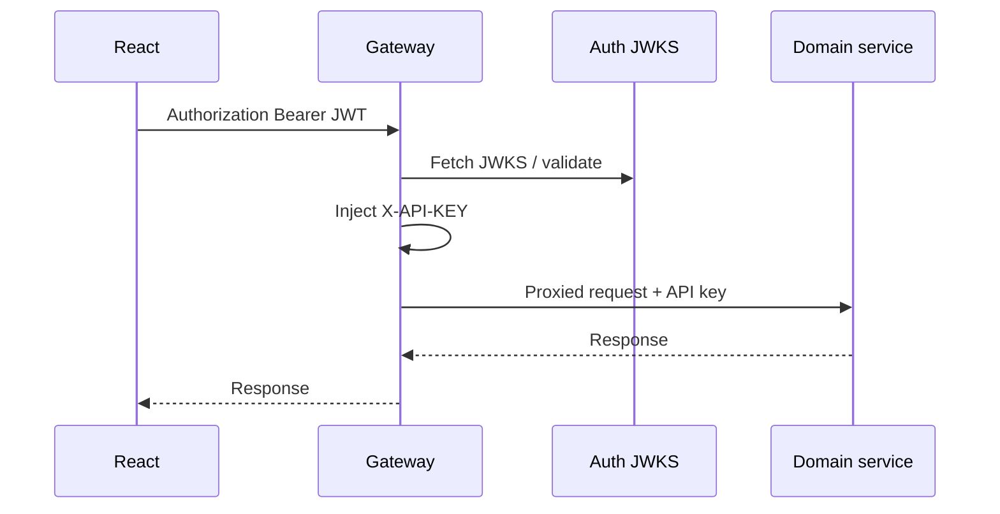
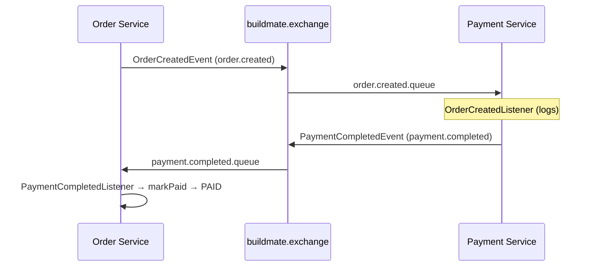

# 02 — System Architecture

## Host vs Docker-internal ports

| Audience | What to use |
|----------|-------------|
| Browser, curl, Compass, Vite on the **host** | Final host ports in [PORTS.md](../PORTS.md) (e.g. Gateway `28080`, Frontend `25173`, RabbitMQ AMQP `25672` / UI `25673`, Auth Mongo `27017`) |
| Service → service **inside Compose** | Container DNS + internal ports (e.g. `auth-mongo:27017`, `rabbitmq:5672`, `supplier-service:28084`) — **not** `localhost` |

Spring app listen ports match published host ports (`9000`, `28080`, `28084`–`28087`). Mongo and RabbitMQ map host ports onto container `27017` / `5672` / `15672`.

## 🏗 System architecture



## 🧩 Microservice architecture



## 🐳 Deployment architecture



## 🔐 OAuth flow



## 🔏 JWT flow



## 🚪 API Gateway flow

```mermaid
flowchart LR
  REQ["HTTP /api/..."] --> SEC{"JWT valid?"}
  SEC -->|no| E401[401]
  SEC -->|yes| RL[Rate limiter]
  RL --> ROUTE{Route}
  ROUTE -->|/api/suppliers/**| SUP
  ROUTE -->|/api/materials|brands|categories| MAT
  ROUTE -->|/api/payments|invoices|reports| PAY
  ROUTE -->|/api/orders|inventory|cart|health| ORD
  ROUTE -->|/api/auth/**| AUTH
  SUP & MAT & PAY & ORD & AUTH --> REWRITE[RewritePath strip /api]
  REWRITE --> KEY[AddRequestHeader X-API-KEY]
  KEY --> UP[Upstream service]
```

## 📨 RabbitMQ payment flow



## 📦 Container architecture

| Container | Role | Profile |
|-----------|------|---------|
| `auth-mongo` … `order-mongo` | Dedicated MongoDB | `api`, `full` |
| `rabbitmq` | Broker + management | `api`, `full` |
| `auth-server` … `order-inventory-service` | Spring APIs | `api`, `full` |
| `api-gateway` | Edge | `api`, `full` |
| `buildmate-client` | nginx SPA | `full` only |

Network: **`buildmate-network`** (bridge).

## Ports summary (host-facing)

| Port | Component |
|-----:|-----------|
| 25173 | Frontend |
| 28080 | Gateway |
| 9000 | Auth |
| 28084–28087 | Supplier / Material / Payment / Order |
| 27017, 27020–27023 | Mongo hosts (Auth on **27017**) |
| 25672 / 25673 | RabbitMQ AMQP / Management UI |
