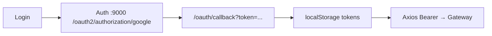

# 04 — Frontend Architecture

> Client: **`buildmate-client/`** — React + Vite SPA.

---

## 🛠 Technology

| Layer | Choice (from repo) |
|-------|--------------------|
| UI library | React 19 |
| Bundler / dev server | Vite 8 (`localhost:25173`) |
| Routing | `react-router-dom` |
| HTTP | Axios (`src/services/api.js`) |
| Auth state | React Context (`AuthContext.jsx`) |
| Theme | `ThemeContext.jsx` + CSS variables |
| Production image | nginx serving static build (`Dockerfile`, Compose profile `full`) |

---

## 🗺 Routing

Defined in `App.jsx`:

| Path | Component | Access |
|------|-----------|--------|
| `/login` | `Login` | Public |
| `/oauth/callback` | `OAuthCallback` | Public |
| `/` | `Dashboard` | Protected + `MainLayout` |
| `/materials` | `Materials` | Protected |
| `/suppliers` | `Suppliers` | Protected |
| `/orders` | `Orders` | Protected |
| `/cart` | `Cart` | Protected |
| `/inventory` | `Inventory` | Protected |
| `/payments` | `Payments` | Protected |
| `/invoices` | `Invoices` | Protected |
| `/reports` | `Reports` | Protected |
| `*` | Redirect → `/` | — |

`ProtectedRoute` redirects unauthenticated users to `/login`.

---

## 📁 Structure (key paths)

```text
buildmate-client/
├── src/
│   ├── App.jsx
│   ├── main.jsx
│   ├── pages/          # Login, OAuthCallback, Dashboard, Materials, …
│   ├── components/
│   │   ├── layout/     # MainLayout, Header, Sidebar
│   │   └── common/     # Modal, Toast, Loader, …
│   ├── services/       # api.js, supplierApi.js, materialApi.js, orderApi.js, paymentApi.js
│   ├── context/        # AuthContext
│   ├── theme/          # ThemeContext
│   └── styles/         # global.css, layout.css, page CSS
├── vite.config.js      # /api → http://localhost:28080
├── .env / .env.example
└── Dockerfile
```

---

## 🧩 Layouts & components

| Component | Role |
|-----------|------|
| `MainLayout` | Shell with header + sidebar + `<Outlet />` |
| `Header` | User / theme / logout affordances |
| `Sidebar` | Nav to dashboard & domain pages |
| Common UI | `ConfirmDialog`, `EmptyState`, `Loader`, `Modal`, `SideDrawer`, `Skeleton`, `StatusBadge`, `Toast` |

---

## 🌐 Axios & API base

```js
// src/services/api.js
baseURL = import.meta.env.VITE_API_BASE || '/api'
```

- Dev: `VITE_API_BASE=/api` + Vite proxy → **`http://localhost:28080`**
- Request interceptor attaches `Authorization: Bearer <token>`

| Module | Responsibility |
|--------|----------------|
| `supplierApi.js` | Suppliers & documents |
| `materialApi.js` | Materials, brands, categories |
| `orderApi.js` | Orders, cart, inventory |
| `paymentApi.js` | Payments, invoices, reports |

---

## 🔐 Authentication (frontend)



| localStorage key | Purpose |
|------------------|---------|
| `buildmate_access_token` | JWT |
| `buildmate_token_expires_at` | Expiry |
| `buildmate_user` | Cached user profile |

Env-related:

| Variable | Purpose |
|----------|---------|
| `VITE_API_BASE` | API prefix (default `/api`) |
| `VITE_AUTH_SERVER_URL` | Auth server base |
| `VITE_GOOGLE_LOGIN_URL` | Google OAuth entry URL |

---

## 🎨 Theme & UI system

- `ThemeContext` toggles `light` / `dark`
- Persisted as `buildmate_theme` in `localStorage`
- Sets `data-theme` on `document.documentElement`
- Design tokens live in `src/styles/global.css` (`:root` + `[data-theme="dark"]`)
- Page-scoped styles: `dashboard.css`, `materials.css`, `suppliers.css`, etc.

---

## 📝 Optional Express proxy

`buildmate-client/server/` contains a legacy Express proxy option. **Primary path** in this project is Vite → Gateway (`:28080`). Prefer documented Vite + Docker nginx flows.

---

## Related

- [06-API-Documentation](./06-API-Documentation.md)
- [09-Security-Documentation](./09-Security-Documentation.md)
- [15-User-Manual](./15-User-Manual.md)
