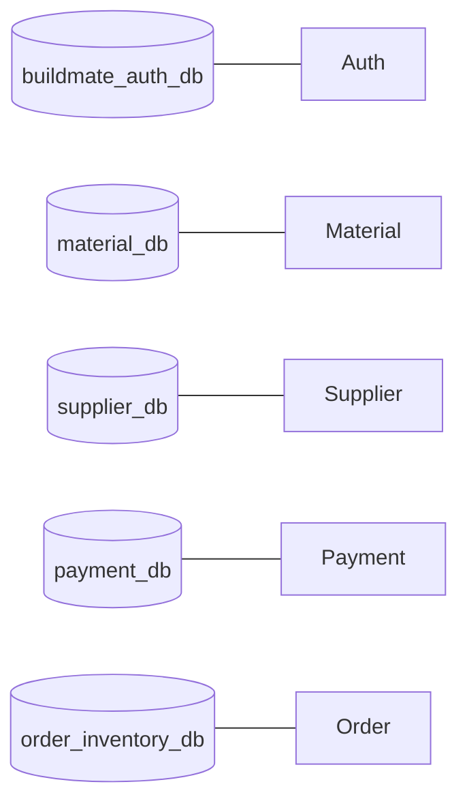

# 07 — Database Documentation

BuildHub uses **one MongoDB instance (and database) per bounded context**. There is no shared business database across services.

---

## Instance map

| Service | Host port | Container (Compose) | Database name |
|---------|----------:|---------------------|---------------|
| Auth | **27017** | `auth-mongo` | `buildmate_auth_db` |
| Material | **27020** | `material-mongo` | `material_db` |
| Supplier | **27021** | `supplier-mongo` | `supplier_db` |
| Payment | **27022** | `payment-mongo` | `payment_db` |
| Order & Inventory | **27023** | `order-mongo` | `order_inventory_db` |

### Host vs Docker-internal

| From | URI style |
|------|-----------|
| Host tools (Compass, native Java) | `mongodb://localhost:<host-port>/<db>` |
| Containers on `buildmate-network` | `mongodb://<service>-mongo:27017/<db>` — **not** `localhost` |

Each Mongo container listens on **27017 inside**. Compose publishes Auth as `27017:27017` and the others as `27020–27023:27017`.

Host URI pattern examples:

```text
mongodb://localhost:27017/buildmate_auth_db
mongodb://localhost:27020/material_db
mongodb://localhost:27021/supplier_db
mongodb://localhost:27022/payment_db
mongodb://localhost:27023/order_inventory_db
```

Docker Compose internal examples:

```text
mongodb://auth-mongo:27017/buildmate_auth_db
mongodb://material-mongo:27017/material_db
mongodb://supplier-mongo:27017/supplier_db
mongodb://payment-mongo:27017/payment_db
mongodb://order-mongo:27017/order_inventory_db
```

Image: **`mongo:7`**. See also [PORTS.md](../PORTS.md).

---

## Auth — `buildmate_auth_db`

| Collection | Entity | Purpose |
|------------|--------|---------|
| `users` | `User` | Marketplace users after Google OAuth upsert |

---

## Supplier — `supplier_db`

| Collection | Entity | Purpose |
|------------|--------|---------|
| `suppliers` | `Supplier` | Supplier profiles, rating, status |
| `supplier_documents` | `Document` | Uploaded compliance/docs metadata |
| `api_keys` | `ApiKey` | Valid `X-API-KEY` values |

**Seed:** `docker/mongo-init/supplier/01-seed-api-key.js` seeds `buildmate-supplier-key`.

---

## Material — `material_db`

| Collection | Entity | Purpose |
|------------|--------|---------|
| `materials` | `Material` | Catalog items (name, price, stock, supplierId, …) |
| `categories` | `Category` | Category master data |
| `brands` | `Brand` | Brand master data |
| `material_images` | `MaterialImage` | Image metadata |
| `api_keys` | `ApiKey` | Service API keys |

**Seed:** `docker/mongo-init/material/01-seed-api-key.js`.

---

## Payment — `payment_db`

| Collection | Entity | Purpose |
|------------|--------|---------|
| `payments` | `Payment` | Payment records |
| `invoices` | `Invoice` | Invoice records |
| `api_keys` | `ApiKey` | Service API keys (**Mongo-only** validation — no env fallback) |

**Seed:** `docker/mongo-init/payment/01-seed-api-key.js` (`buildmate-payment-key`).

Reports (`revenue`, `monthly`, `top-customers`) are **computed** from payments data, not separate persistent report collections.

---

## Order & Inventory — `order_inventory_db`

| Collection | Entity | Purpose |
|------------|--------|---------|
| `orders` | `Order` | Customer orders + status (incl. **PAID** via events) |
| `order_history` | `OrderHistory` | Order change history |
| `cart` | `Cart` | Cart lines per user |
| `inventory` | `Inventory` | Stock reservation state |
| `inventory_history` | `InventoryHistory` | Reserve/release history |
| `api_keys` | `ApiKey` | Service API keys (**Mongo-only**) |

**Seed:** `docker/mongo-init/order/01-seed-api-key.js` (`buildmate-order-key`).

---

## Volumes (Compose)

| Volume | Backs |
|--------|-------|
| `auth-mongo-data` | Auth Mongo |
| `material-mongo-data` | Material Mongo |
| `supplier-mongo-data` | Supplier Mongo |
| `payment-mongo-data` | Payment Mongo |
| `order-mongo-data` | Order Mongo |

Init scripts under `/docker-entrypoint-initdb.d` run **only on first empty volume**.

---

## Data isolation principles



Cross-service consistency for paid orders uses **RabbitMQ events**, not shared Mongo transactions.
