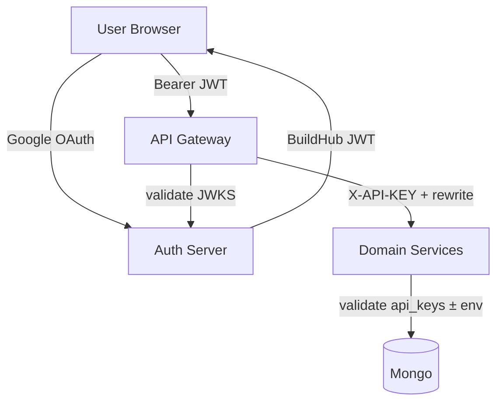
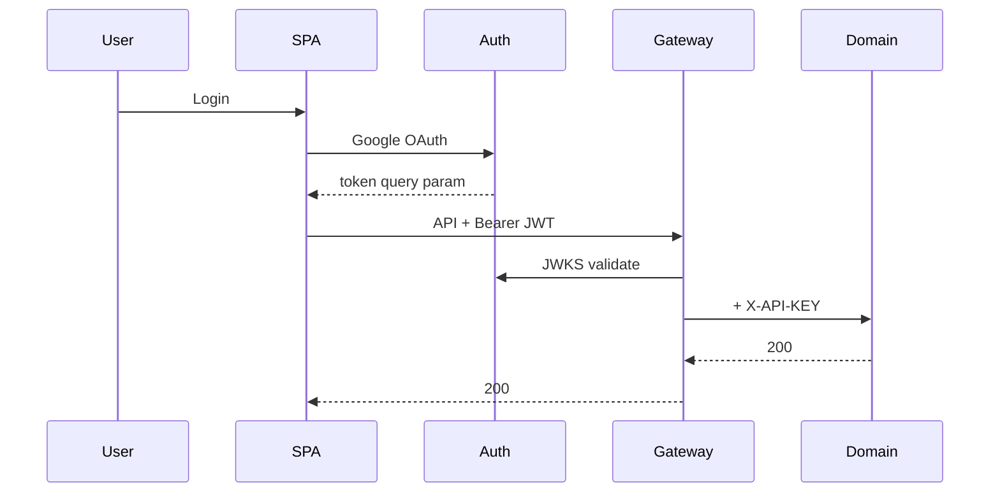

# 09 — Security Documentation

BuildHub uses **defense in depth**: Google OAuth + BuildHub JWT at the edge, and **service API keys** on domain services.

---

## Layers

---

## OAuth2 (Google)

| Item | Value / behavior |
|------|------------------|
| Provider | Google (Spring OAuth2 Client) |
| Start URL | `http://localhost:9000/oauth2/authorization/google` |
| Success redirect | `http://localhost:25173/oauth/callback` (`BUILDMATE_FRONTEND_SUCCESS_URL`) |
| Failure redirect | `http://localhost:25173/login` |
| Credentials | From `.env` / Auth `local` profile (`GOOGLE_CLIENT_ID` / `GOOGLE_CLIENT_SECRET`) — never commit real secrets |

Auth upserts the user in `users`, then issues a BuildHub JWT for the SPA.

---

## JWT (BuildHub)

| Setting | Default / source |
|---------|------------------|
| Algorithm | **RS256** |
| Issuer | `http://localhost:9000` (`BUILDMATE_AUTH_ISSUER`) |
| JWKS | `http://localhost:9000/oauth2/jwks` |
| Access TTL | **60** minutes (`buildmate.auth.access-token-ttl-minutes`) |
| Key id | `buildmate-auth-key` |
| RSA key path | `BUILDMATE_AUTH_RSA_KEY_PATH` (Docker volume `auth-rsa-data`) |

Gateway:

| Env | Typical Compose value |
|-----|------------------------|
| `JWT_ISSUER_URI` | `http://localhost:9000` |
| `JWT_JWK_SET_URI` | `http://auth-server:9000/oauth2/jwks` |

Registered OAuth clients (in-memory Auth config): `buildmate-spa` (PKCE), `buildmate-client` (client credentials).

---

## API Keys

| Header | `X-API-KEY` |
|--------|-------------|

| Service | Validation | Default key |
|---------|------------|-------------|
| Supplier | Mongo `api_keys` + env `SUPPLIER_API_KEY` | `buildmate-supplier-key` |
| Material | Mongo + `MATERIAL_API_KEY` | `buildmate-material-key` |
| Payment | **Mongo only** | `buildmate-payment-key` (seed) |
| Order | **Mongo only** | `buildmate-order-key` (seed) |

Gateway injects the correct key per route from its environment (`SUPPLIER_API_KEY`, `MATERIAL_API_KEY`, `PAYMENT_API_KEY`, `ORDER_API_KEY`). Prefer values from `.env` in real deployments.

---

## Gateway authentication

### Public (no JWT)

- `OPTIONS /**`
- `/actuator/health`, `/actuator/info`
- `/fallback/**`
- `/api/auth/health`

### Protected

All other exchanges require a valid Bearer JWT.

Additional controls: CORS; in-memory rate limiter (replenish **10** / burst **20**).

---

## Service authentication

Domain services **do not validate end-user JWTs**. They trust:

1. Correct `X-API-KEY`, and/or  
2. Being called only from trusted network/Gateway in deployment.

Swagger UI, OpenAPI docs, and Actuator paths are generally **excluded** from ApiKey filters (see each service filter). Order also excludes `/health`.

---

## Auth Server filter chains (ordered)

1. Authorization server / OIDC endpoints  
2. `/api/**` JWT resource server (`/api/auth/me` protected; health public)  
3. Default chain with OAuth2 login for browser flows  

---

## Protected vs public endpoints (summary)

| Endpoint class | Gateway | Domain |
|----------------|---------|--------|
| `/api/auth/health` | Public | Public |
| `/api/auth/me` | JWT | JWT (Auth) |
| `/api/suppliers/**` etc. | JWT | API key |
| Swagger / Actuator (service ports) | N/A usually | No API key |
| Direct business APIs on :28084–28087 | N/A | API key required |

---

## Security flow (happy path)

---

## Implications (as implemented)

- Calling domain ports **without** going through the Gateway bypasses JWT enforcement.
- Payment/Order keys must exist in Mongo seeds for containers / empty volumes.
- OAuth redirect URLs are **localhost-oriented** for demo/academic use (frontend host port **25173**).

See also [17-Known-Issues](./17-Known-Issues.md).
