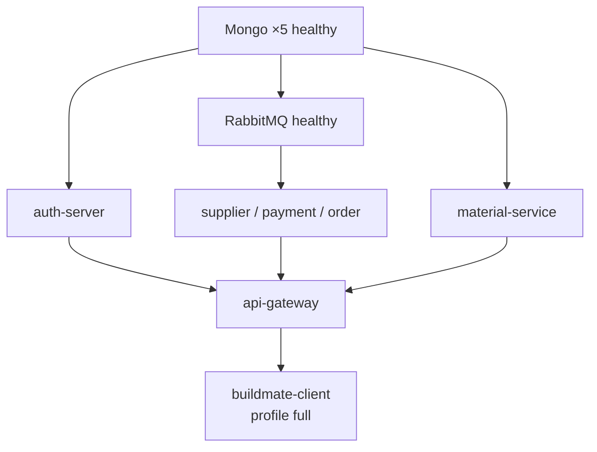

# 10 — Docker Deployment

> Source of truth: root `docker-compose.yml` (project name **`buildmate`**) and [PORTS.md](../PORTS.md).

---

## Host vs Docker-internal ports

| Layer | Rule |
|-------|------|
| **Host** (browser, curl, Compass) | Use published ports: Auth Mongo `27017`, Material–Order Mongo `27020–27023`, Auth `9000`, Gateway `28080`, Supplier–Order `28084–28087`, Frontend `25173`, RabbitMQ AMQP `25672`, Management UI `25673` |
| **Inside Compose** | Use DNS names + container ports: `*-mongo:27017`, `rabbitmq:5672`, Spring services on their listen ports (`28084`, …). Do **not** use `localhost` between containers |

---

## Profiles

| Profile | Includes |
|---------|----------|
| **`api`** | 5× Mongo, RabbitMQ, Auth, Supplier, Material, Payment, Order, API Gateway |
| **`full`** | Everything in `api` **+** `buildmate-client` (nginx SPA on host port **25173** → container `80`) |

```bash
docker compose --profile api up -d --build
docker compose --profile full up -d --build

docker compose --profile api down
docker compose --profile full down
```

---

## Dockerfiles

| Context | Dockerfile | Build style |
|---------|------------|-------------|
| `auth-server/` | multi-stage Temurin 21 | Maven build → runtime |
| `api-gateway/` | multi-stage | same |
| `supplier-service/` | multi-stage | same |
| `material-service-main/` | multi-stage | same |
| `payment-service-main/` | multi-stage | same |
| `order-inventory-service-main/` | multi-stage | same |
| `buildmate-client/` | Node build → nginx | static SPA |

Application images define **HEALTHCHECK** against Actuator (and client nginx). Compose additionally healthchecks Mongo ×5 and RabbitMQ.

---

## Network

| Name | Driver |
|------|--------|
| `buildmate-network` | bridge |

All listed Compose services attach to this network (client included under `full`).

---

## Volumes

| Volume |
|--------|
| `auth-mongo-data` |
| `material-mongo-data` |
| `supplier-mongo-data` |
| `payment-mongo-data` |
| `order-mongo-data` |
| `rabbitmq-data` |
| `auth-rsa-data` |

Init mounts (read-only):

- `./docker/mongo-init/material` → material-mongo  
- `./docker/mongo-init/supplier` → supplier-mongo  
- `./docker/mongo-init/payment` → payment-mongo  
- `./docker/mongo-init/order` → order-mongo  

Auth also mounts `./auth-server/config:/app/config:ro`.

---

## Health checks

| Target | Mechanism |
|--------|-----------|
| Mongo ×5 | `mongosh` admin ping — interval 10s, retries 10, start 20s |
| RabbitMQ | `rabbitmq-diagnostics ping` — retries 12, start 30s |
| Spring apps | Dockerfile HEALTHCHECK (Actuator), start-period ~90s |
| Client | Dockerfile HEALTHCHECK |

`depends_on` uses `condition: service_healthy` for ordered readiness.

---

## Container startup order (effective)



---

## Environment variables (Compose-highlighted)

### Auth

| Variable | Example / note |
|----------|----------------|
| `SPRING_PROFILES_ACTIVE` | `local` |
| `MONGODB_URI` / Spring Mongo URIs | `mongodb://auth-mongo:27017/buildmate_auth_db` |
| `BUILDMATE_AUTH_ISSUER` | `http://localhost:9000` |
| `BUILDMATE_FRONTEND_SUCCESS_URL` | `http://localhost:25173/oauth/callback` |
| `BUILDMATE_FRONTEND_FAILURE_URL` | `http://localhost:25173/login` |
| `BUILDMATE_AUTH_RSA_KEY_PATH` | `/app/.buildmate/auth-rsa.jwk` |

Google OAuth and other secrets come from `.env` / Auth local config — do not hardcode passwords in Compose docs.

### Domain + Gateway

| Variable | Used by |
|----------|---------|
| `RABBITMQ_HOST=rabbitmq` | Supplier, Payment, Order |
| `RABBITMQ_PORT=5672` | same (container AMQP port; host maps **25672→5672**) |
| `RABBITMQ_USERNAME` / `RABBITMQ_PASSWORD` | From `.env` (broker + apps) |
| `SUPPLIER_API_KEY` | Supplier + Gateway |
| `MATERIAL_API_KEY` | Material + Gateway |
| `PAYMENT_API_KEY` | Gateway (Payment validates Mongo key) |
| `ORDER_API_KEY` | Gateway (Order validates Mongo key) |
| `JWT_ISSUER_URI` / `JWT_JWK_SET_URI` | Gateway |
| `*_SERVICE_URL` | Gateway upstreams (`http://supplier-service:28084`, etc.) |

> Services use **container DNS names**, not `localhost`, for Mongo and RabbitMQ when running under Compose.

---

## Published host ports

| Host port | Mapping / container |
|----------:|---------------------|
| 27017 | `auth-mongo` (`27017:27017`) |
| 27020–27023 | material / supplier / payment / order-mongo (`→27017`) |
| 25672, 25673 | RabbitMQ AMQP / management (`→5672` / `→15672`) |
| 9000 | auth-server |
| 28084–28087 | domain services |
| 28080 | api-gateway |
| 25173→80 | buildmate-client (`full`) |

---

## Useful commands

```bash
docker compose --profile api ps
docker compose --profile api logs -f api-gateway
docker compose --profile full up -d --build
docker compose --profile api down -v   # removes volumes — destructive
```

Prefer `down` without `-v` unless you intentionally reset databases and API-key seeds.
